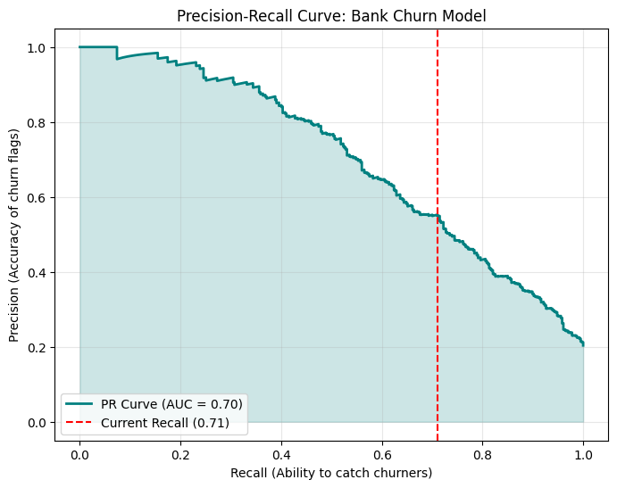
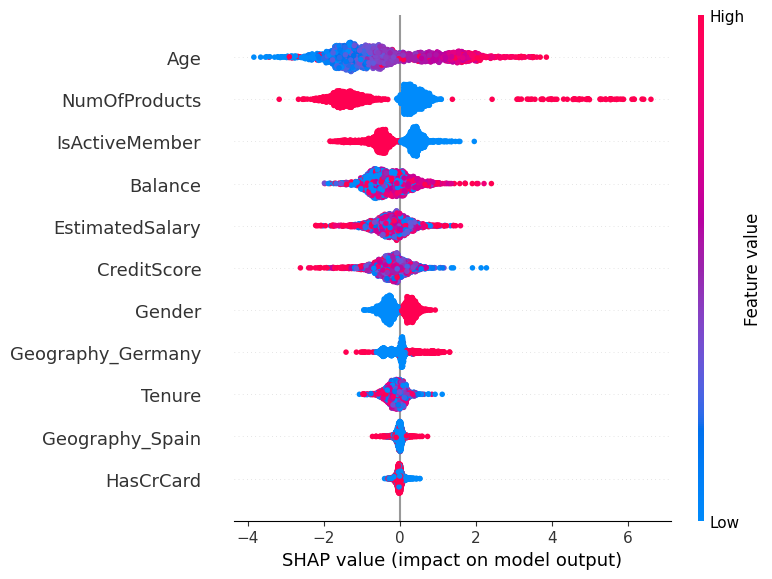
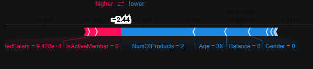

# 🏦 Bank Customer Churn Prediction & Analytics

This repository features an end-to-end Machine Learning solution designed to predict customer attrition (churn) for a retail bank. Utilizing an **Optimized XGBoost Classifier**, the project identifies high-risk customers and employs **Explainable AI (SHAP)** to provide transparent financial drivers behind every prediction.

---

## 🎯 Business Objective
In banking, customer retention is a primary driver of long-term profitability. As a Finance Associate, I developed this model to:
* **Minimize Revenue Leakage:** Identify at-risk customers with high sensitivity (**Recall**).
* **Strategic Allocation:** Optimize marketing spend by targeting customers with the highest probability of churn.
* **Transparency:** Provide "Black Box" model interpretability for audit and stakeholder review.

---

## 🛠️ Key Features
The model analyzes core banking attributes to predict behavior:
* **Demographics:** Age, Gender, and Geography (France, Germany, Spain).
* **Account Standing:** Credit Score, Tenure, and Account Balance.
* **Engagement:** Number of Products, Credit Card Status, and Active Membership.

---

## 📈 Performance Results

| Metric | Score | Impact for the Bank |
| :--- | :--- | :--- |
| **Accuracy** | **82%** | High overall system reliability for the total customer base. |
| **Recall** | **71%** | **Strategic Success:** We identify 71% of all customers planning to leave. |
| **Precision** | **55%** | 55% of alerts are true churners, significantly reducing "Marketing Fatigue." |
| **F1-Score** | **0.62** | A robust balance between sensitivity and reliability. |

### **Strategic Optimization: The Precision-Recall Curve**
In banking, a **False Negative** (failing to catch a churner) is significantly more expensive than a **False Positive**. Consequently, I prioritized **Recall** during hyperparameter tuning using `RandomizedSearchCV`.

---

## 🔍 Explainable AI (SHAP)
Regulatory compliance and trust are paramount in finance. I integrated **SHAP (SHapley Additive exPlanations)** to visualize the decision-making process.

### **1. Global Impact (Summary Plot)**
The Summary Plot reveals the most influential features across the entire bank. We observe that **Age**, **Number of Products**, and **IsActiveMember** are the top drivers influencing customer decisions.

### **2. Individual Case Study (Force Plot)**
The Force Plot breaks down a single prediction into a "tug-of-war" of features. **Red features** push the risk higher, while **Blue features** pull the risk lower toward retention.

---

## 🧠 Technical Challenges & Solutions
* **Imbalanced Classes:** Addressed data skew by using `scale_pos_weight` in XGBoost to ensure the model focuses effectively on the minority "Exited" class.
* **Hyperparameter Tuning:** Conducted `RandomizedSearchCV` to optimize tree depth and learning rates, preventing overfitting while maintaining high recall.
* **Interpretability:** Integrated SHAP to transform the "Black Box" XGBoost model into an explainable tool suitable for financial risk audits.
